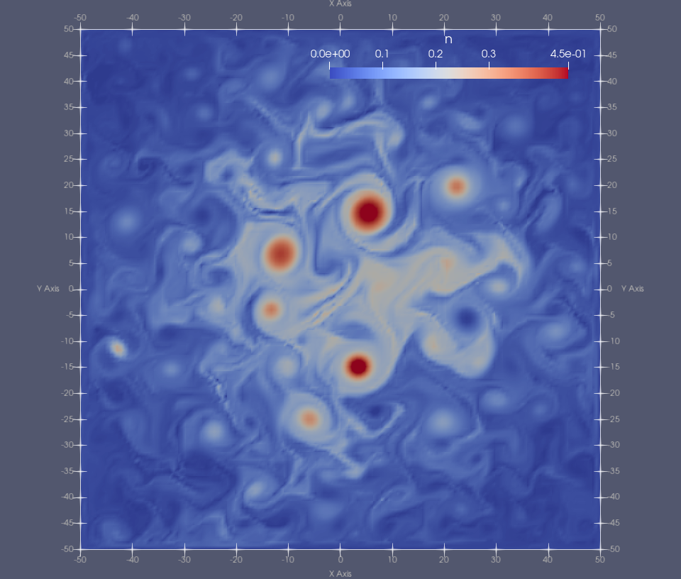

# The DriftReduced solver

## Overview (improve)
The `DriftReduced` solver provides a number of simple models for 2D and 3D plasma turbulence.
The models are grouped together because they all directly or indirectly incorporate an $E{\times}B$ plasma drift velocity, calculated via the gradient of the electrostatic potential, which in turn is calculated from a vorticity field. The machinery to advect the plasma according to this drift velocity is therefore implemented in a common class from which all of the model equation systems are derived. 

The following subsections describe the examples that are currently available:

## Examples

### 2DHW (improve)

The example can be run with

    ./scripts/run_eg.sh DriftReduced 2DHW

#### Equations (improve)

Solves the 2D Hasegawa-Wakatani (HW) equations. That is:

$$
\begin{align}
    \frac{\partial n}{\partial t} + [\phi, n]  & = \alpha (\phi - n) - \kappa \frac{\partial\phi}{\partial y} &~~~(1)\\
    \frac{\partial{\zeta}}{\partial t} + [\phi, \zeta] & = \alpha (\phi - n) &~~~(2)
\end{align}
$$

where $n$ is number density, $\zeta$ is vorticity and $\phi$ is the electrostatic potential.
$[a,b]$ is the Poisson bracket operator, defined as

$$
\begin{equation}
    [a,b] = \frac{\partial a}{\partial x} \frac{\partial b}{\partial y} - \frac{\partial a}{\partial y} \frac{\partial 
b}{\partial x}.
\end{equation}
$$

Note that equations (1) and (2) represent the "unmodified" form of the HW equations, which exclude so called *zonal flows* (see e.g. [this webpage](https://ammar-hakim.org/sj/je/je17/je17-hasegawa-wakatani.html#the-modified-hasegawa-wakatani-system) for further explanation.)

#### Model parameters

The table below shows a selection of the model parameters that can be modified under the `PARAMETERS` node of the XML configuration file. 

| Parameter | Label in config file | Description                                                                               | Default value |
| --------- | -------------------- | ----------------------------------------------------------------------------------------- | ------------- |
| $B$       | Bxy                  | Magnetic field strength (normalised units)                                                | 1.0           |
| $\alpha$  | HW_alpha             | Adiabacity parameter: controls coupling between $n$ and $\phi$                            | 2.0           |
| $\kappa$  | HW_kappa             | Turbulent drive parameter: assumed scale length of background exponential density profile | 1.0           |
| -         | s                    | Initial blob size: Scale length of the Gaussian density ICs (normalised units)            | 2.0           |

*Table 1: Configurable model parameters for the 2DHW example*

#### Implementation (unfinished)
<!-- Domain -->
<!-- Mesh, elements -->
<!-- Solver opts -->
<!-- Timestepping -->
<!-- ICs -->
#### Outputs (unfinished)

<!-- ------------------------------------------------------------------------------------------ -->

### 2Din3DHW_fluid_only (improve)

Solves the 2D HW equations, (1) and (2), in a 3D domain. 

The example can be run with

    ./scripts/run_eg.sh DriftReduced 2Din3DHW_fluid_only

#### Implementation (unfinished)

The list of configurable model parameters is the same as for the `2DHW` example; see [Table 1](#model-parameters).

<!-- Domain -->
<!-- Mesh, elements -->
<!-- Solver opts -->
<!-- Timestepping -->
<!-- ICs -->

#### Outputs (unfinished)

<!-- ------------------------------------------------------------------------------------------ -->

### 2Din3DHW

Solves equations (1) and (2), as in the previous example, but also enables a system of neutral particles that are coupled to the fluid solver. Particles deposit density into the (plasma) fluid via ionization.

The example can be run with

    ./scripts/run_eg.sh DriftReduced 2Din3DHW

#### Model parameters

In addition to those parameters listed in [Table 1](#model-parameters), a number of particle system properties can be configured.

| Parameter      | Label in config file      | Description                                                                                      | Default value |
| -------------- | ------------------------- | ------------------------------------------------------------------------------------------------ | ------------- |
| $N_{\rm part}$ | num_particles_total       | Total number of (neutral) particles to generate.                                                 | 100000        |
| -              | particle_output_freq      | Number of steps between particle outputs.                                                        | 40            |
| $n_{\rm phys}$ | particle_number_density   | Physical number density of neutrals in SI units                                                  | 1e16          |
| $v_{\rm th}$   | particle_thermal_velocity | Width of the Gaussian from which random particle thermal velocities are drawn. Normalised units. | 1.0           |
| $v_{\rm d}$    | particle_drift_velocity   | Bulk drift velocity given to all particles. Normalised units.                                    | 2.0           |
| $\sigma_p$     | particle_source_width     | Width of the Gaussian from which random particle positions are drawn. Normalised units.          | 0.2           |
| $T$            | Te_eV                     | Assumed electron temperature in eV.                                                              | 10.0          |

*Table 2: Configurable model parameters for the 2Din3DHW example*

#### Implementation (unfinished)
<!-- Domain -->
<!-- Mesh, elements -->
<!-- Solver opts -->
<!-- Timestepping -->
<!-- ICs -->

#### Outputs (unfinished)

<!-- ------------------------------------------------------------------------------------------ -->

### 2DRogersRicci

Model based on the **2D** (finite difference) implementation described in "*Low-frequency turbulence in a linear magnetized plasma*", B.N. Rogers and P. Ricci, PRL **104**, 225002, 2010 ([link](https://journals.aps.org/prl/abstract/10.1103/PhysRevLett.104.225002)); see equations (7)-(9).

The example can be run with

    ./scripts/run_eg.sh DriftReduced 2DRogersRicci

#### Equations

In SI units, the equations are:

$$
\begin{aligned}
\frac{d n}{dt} &= -\sigma\frac{n c_s}{R}\exp(\Lambda - e\phi/T_e) + S_n &~~~(3)\\
\frac{d T_e}{dt} &= -\sigma\frac{2}{3}\frac{T_e c_s}{R}\left[1.71\exp(\Lambda - e\phi/T_e)-0.71\right] + S_T &~~~(4)\\
\frac{d \nabla^2\phi}{dt} &= \sigma \frac{c_s m_i \Omega_{ci}^2}{eR}\left[1-\exp(\Lambda - e\phi/T_e)\right] &~~~(5)\\
\end{aligned}
$$

where

$$
\begin{aligned}
\sigma &= \frac{1.5 R}{L_z} \\
\frac{df}{dt} &= \frac{\partial f}{\partial t} - \frac{1}{B}\left[\phi,f\right] \\
\end{aligned}
$$

and the source terms have the form

$$
\begin{aligned}
S_n &= S_{0n}\frac{1-{\rm tanh[(r-r_s)/L_s]}}{2} \\
S_T &= S_{0T}\frac{1-{\rm tanh[(r-r_s)/L_s]}}{2} \\
\end{aligned}
$$

where $r = \sqrt{x^2 + y^2}$

#### Model parameters

| Parameter     | Label in config file | Description                         | Default Value |
| ------------- | -------------------- | ----------------------------------- | ------------- |
| $T_{e0}$      | T_0                  | Temperature.                        | 6 eV          |
| $m_i$         | m_i                  | Ion mass.                           | 6.67e-27 kg   |
| $\Lambda$     | coulomb_log          | Couloumb Logarithm.                 | 3             |
| $\Omega_{ci}$ | Omega_ci             | Ion cyclotron frequenxy in Hz.      | $9.6e5$       |
| R             | R                    | Approx radius of the plasma column. | 0.5 m         |

*Table 3: Configurable model parameters for the 2DRogersRicci example*

<!-- Add these back in once the normalisation factors are calculated correctl; hard-coded for now -->
<!-- | $n_0$     |                      | Density normalisation factor in $m^{-3}$. | $2e18$        | -->
<!-- | $L_z$         | XXX                  | Assumed length of the device (perpendicular to the 2D domain) in m. | 18            | -->

Derived values
| Parameter   | Description                              | Calculated as            | Value                               |
| ----------- | ---------------------------------------- | ------------------------ | ----------------------------------- |
| B           | Magnetic field strength.                 | $\Omega_{ci} m_i q_E$    | 40 mT                               |
| $c_{s0}$    | Sound speed.                             | $\sqrt{T_{e0}/m_i}$      | 1.2e4 ms-1               |
| $\rho_{s0}$ | Larmor radius.                           | $c_{s0}/\Omega{ci}$      | 1.2e-2 m                            |
| $S_{0n}$    | Density source scaling factor.           | 0.03 $n_0 c_{s0}/R$      | 4.8e22 m-3s-1 |
| $S_{0T}$    | Temperature source scaling factor.       | 0.03 $T_{e0} c_{s0} / R$ | 4318.4 Ks-1              |
| $\sigma$    |                                          | $1.5 R/L_z$              | 1/24                                |
| $L_s$       | Scale length of source terms.            | $0.5\rho_{s0}$           | 6e-3 m                              |
| $r_s$       | Approx radius of the LAPD plasma chamber | $20\rho_{s0}$            | 0.24 m                              |

#### Normalisation

Normalisations follow those in Rogers & Ricci, that is:

|                       | Normalised to   |
| --------------------- | --------------- |
| Charge                | $e$             |
| Electric potential    | $e/T_{e0}$      |
| Energy                | $T_{e0}$        |
| Number densities      | $n_0$           |
| Perpendicular lengths | $100 \rho_{s0}$ |
| Parallel lengths      | $R$             |
| Time                  | $R/c_{S0}$      |

The normalised forms of the equations are:

$$
\begin{align}
\frac{\partial n}{\partial t} &= 40\left[\phi,n\right] -\frac{1}{24}\exp(3 - \phi/T_e)n + S_n  &~~~(6) \\
\frac{\partial T_e}{\partial t} &= 40\left[\phi,T_e\right] -\frac{1}{36}\left[1.71\exp(3 - \phi/T_e)-0.71\right]T_e + S_T  &~~~(7) \\
\frac{\partial  \nabla^2\phi}{\partial t} &= 40\left[\phi,\nabla^2\phi\right] + \frac{1}{24}\left[1-\exp(3 - \phi/T_e)\right] &~~~(8)\\
\nabla^2\phi &= \omega &~~~(9) \\
\end{align}
$$

with 

$$
\begin{equation}
S_n = S_T = 0.03\left\\{1-\tanh[(\rho_{s0}r-r_s)/L_s]\right\\}
\end{equation}
$$

where $\rho_{s0}$, $r_s$ and $Ls$ have the (SI) values listed in the tables above.
<!-- This system can be be obtained by applying the normalisation factors, then simplifying; see [here](./details/rogers-ricci-2d-normalised.md) for details. Note that the prime notation used in the derivations is dropped in the equations above for readability. -->

#### Implementation

The default initial conditions are

| Field    | Default ICs (uniform)                          |
| -------- | ---------------------------------------------- |
| n        | $2\times10^{14} m^{-3}$ ($10^{-4}$ normalised) |
| T        | $6\times10^{-4}$ eV ($10^{-4}$ normalised)     |
| $\omega$ | 0                                              |

All fields have Dirichlet boundary conditions with the following values:

| Field    | Dirichlet BC value |
| -------- | ------------------ |
| n        | $10^{-4}$          |
| T        | $10^{-4}$          |
| $\omega$ | 0                  |
| $\phi$   | $\phi_{\rm bdy}$   |

$\phi_{\rm bdy}$ is set to 0.03 by default. This value ensures that $\phi$ remains relatively flat outside the central source region and avoids boundary layers forming in $\omega$ and $\phi$. 

The mesh is a square with the origin at the centre and size $\sqrt{T_{e0}/m_i}/\Omega{ci} = 100\rho_{s0} = 1.2$ m.
By default, there are 64x64 quadrilateral (square) elements, giving sizes of 1.875 cm = 25/16 $\rho_{s0}$
The default simulation time is $\sim 12$ in normalised units (= $500~{\rm{\mu}s}$).
<!-- Element order -->
<!-- Anything else mentioned in DriftPlane/Implementation? -->

#### Outputs

Processing the final checkpoint of the simulation and rendering it in Paraview should produce output resembling the image below:

Density in normalised units, run with the implicit DG implementation on a 64x64 quad mesh for 12 normalised time units (5 ms).

### 3DHW (unfinished)

<!-- ------------------------------------------------------------------------------------------ -->

## Diagnostics
For the Hasegawa-Wakatani examples (`2DHW`,` 2Din3DHW_fluid_only`, `2Din3DHW`, `3DHW`), the solver can be made to output the total fluid energy ($E$) and enstrophy ($W$), which are defined as:  

$$
\begin{align}
E&=\frac{1}{2}\int (n^2 + |\nabla\phi|^2)~\mathbf{dx}\\ 
W&=\frac{1}{2}\int (n-\zeta)^2~\mathbf{dx}
\end{align}
$$

In the `2Din3DHW_fluid_only` example, the expected growth rates of $E$ and $W$ can be calculated analytically according to:

$$
\begin{align}
\frac{dE}{dt} &= \Gamma_n-\Gamma_\alpha &~~(8)\\
\frac{dW}{dt} &= \Gamma_n &~~(9)
\end{align}
$$

where

$$
\begin{align}
\Gamma_\alpha &= \alpha \int (n - \phi)^2~\mathbf{dx}\\
\Gamma_n &= -\kappa \int n \frac{\partial{\phi}}{\partial y}~\mathbf{dx}
\end{align}
$$

To change the frequency of this output, modify the value of `growth_rates_recording_step` inside the `<PARAMETERS>` node in the example's configuration file.
When that parameter is set, the values of $E$ and $W$ are written to `<run_directory>/growth_rates.h5` at each simulation step $^*$.  Expected values of $\frac{dE}{dt}$ and $\frac{dW}{dt}$, calculated with equations (8) and (9) are also written to file, but note that these are only meaningful when particle coupling is disabled.

$^*$ Note that the file will appear empty until the file handle is closed at the end of simulation.